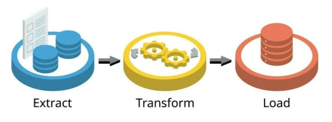

# <h1 align="center"><font color="gree">Building a Data Pipeline in Databricks and using Spark</font></h1>
---

<font color="pink">Senior Data Scientist.: Dr. Eddy Giusepe Chirinos Isidro</font>


A Databricks oferece uma plataforma integrada para processamento de grandes volumes de dados de forma escalável. Neste guia, vamos construir um pipeline de dados utilizando Apache Spark, explorando desde a ingestão até a transformação e armazenamento, com foco na automação para projetos de data Engineering e Analytics.


Neste projeto de Engenharia de Dados basicamente vamos a Extrair, Transformar e Carregar os dados transformados. Para isso vamos usar Spark e construír um pipeline de dados. 




## Por que usar Databricks para Pipelines?

* Processa dados em paralelo
* Suporta múltiplas linguagens como `Python`, `SQL` e `Scala`.
* Interface intuitiva de notebook para codificação e colaboração.


## 🔧 Conexão com o Databricks para trabalhar diretamente com os dados do Volume

### 1️⃣ **Corrigida Incompatibilidade de Versões**
- ❌ **Antes**: `databricks-connect 17.2.0` vs `Runtime 17.1` 
- ✅ **Agora**: `databricks-connect 15.4.14` compatível com `Runtime 17.1`

### 2️⃣ **Conexão Estabelecida**
- ✅ Conectado ao cluster: `0919-175003-lz63w6ap-v2n`
- ✅ Acessando Volume: `/Volumes/workspace/default_eddy/volumeeddy-tmp-sampledata/`
- ✅ Spark versão: `4.0.0` funcionando

### 3️⃣ **Pipeline ETL Completo**
- ✅ Carregamento de dados do Volume Databricks
- ✅ Análises com Spark SQL
- ✅ Window Functions avançadas
- ✅ Conversão para Pandas quando necessário

## 📊 **Funcionalidades Implementadas**

### **🔗 Conexão Databricks**
```python
spark = DatabricksSession.builder.remote(
    host=databricks_host,
    token=databricks_token,
    cluster_id=databricks_cluster_id
).getOrCreate()
```

### **📁 Carregamento do Volume**
```python
volume_path = "/Volumes/workspace/default_eddy/volumeeddy-tmp-sampledata/sample_data.csv"
df_spark = spark.read.csv(volume_path, header=True, inferSchema=True)
```

### **🔍 Análises Avançadas**
- **Estatísticas descritivas** processadas no cluster
- **Spark SQL** para consultas complexas  
- **Window Functions** para rankings e análises
- **Categorização** de dados (adultos vs menores)
- **Agregações** por cidade
- **Conversão para Pandas** para análises locais

## 🚀 **Como usar agora:**

### **1. Execute as células do notebook na ordem:**
- Carrega credenciais
- Conecta e carrega dados do Volume
- Análises avançadas com Spark SQL

### **2. Seus dados estão disponíveis como:**
- `df_spark`: DataFrame Spark (processamento no cluster)
- `df_pandas`: DataFrame Pandas (análises locais)

### **3. Você pode fazer análises como:**
```sql
-- Exemplo de consulta SQL no Spark
spark.sql("""
    SELECT City, AVG(Age) as idade_media
    FROM pessoas 
    GROUP BY City
    ORDER BY idade_media DESC
""").show()
```


Thank God!