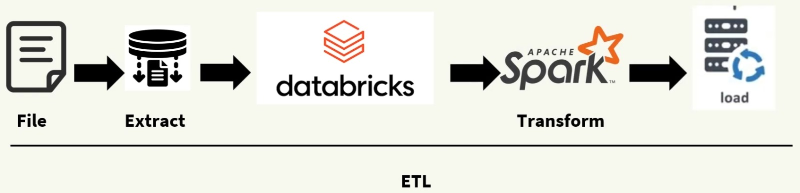

# <h1 align="center">Building a Data Pipeline in Databricks and using Spark</h1>
---

Senior Data Scientist.: Dr. Eddy Giusepe Chirinos Isidro

A Databricks oferece uma plataforma integrada para processamento de grandes volumes de dados de forma escalável. Neste guia, vamos construir um pipeline de dados utilizando Apache Spark, explorando desde a ingestão até a transformação e armazenamento, com foco na automação para projetos de data Engineering e Analytics.

Thank God!